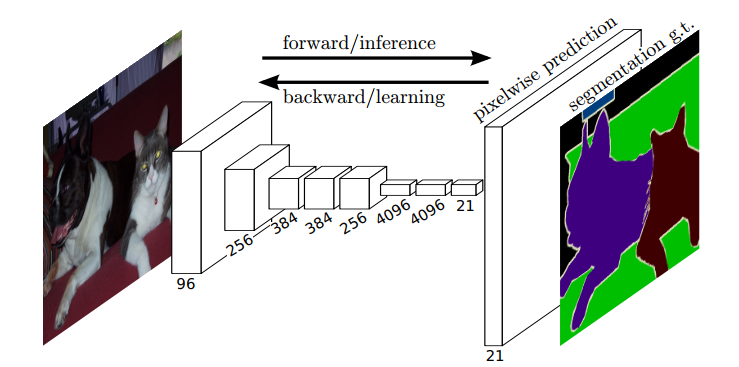

# FCN - Fully Convolutional Networks for Semantic Segmentation

说起语义分割，就不能不提FCN，全称是 Fully Convolutional Networks (全卷积网络)。 我记得,FCN应该算是比较早地将**卷积神经网络**应用到**语义分割**任务当中的例子。后期的很多语义分割模型都是在此基础上发展而来的，因此可见FCN在语义分割网络中的重要地位。先来一张论文中关于FCN的网络结构的图吧。

FCN网络是第一个能够实现端到端训练的全卷积神经网络。
不同于之前的深度学习分类网络，FCN没有用全连接层(Fully connected layer)，而是用卷积层(Convoluational layer)进行替代。这样可以带来一个明显的好处：理论上可以接受**任意尺寸**的输入图像，并且输出相对应尺寸的特征图。

我比较喜欢论文中的这样一句话：

> global information resolves what while local information resolves where

这句话其实点出了深度学习网络中的一些特征分布的特点：

* 全局特征(高维特征)可以更好地描述整体的语义情况，例如类别信息；
* 局部特征(浅层特征)可以更好地描述细节信息，比如位置、纹理、颜色等等。

一般来说，针对分类任务的深度学习模型对输入的图片进行一层一层地信息提取，先提取浅层特征，然后再提取高维特征，最后告诉使用者图片的类别。这样的过程就有点像总结和归纳。而针对语义分割模型而言，如果要实现逐像素的分类，那么就必须要同时解决what(分类)和where(分割)的问题。因此，语义分割模型往往需要融合局部特征和全局特征，并给出最后的答案。